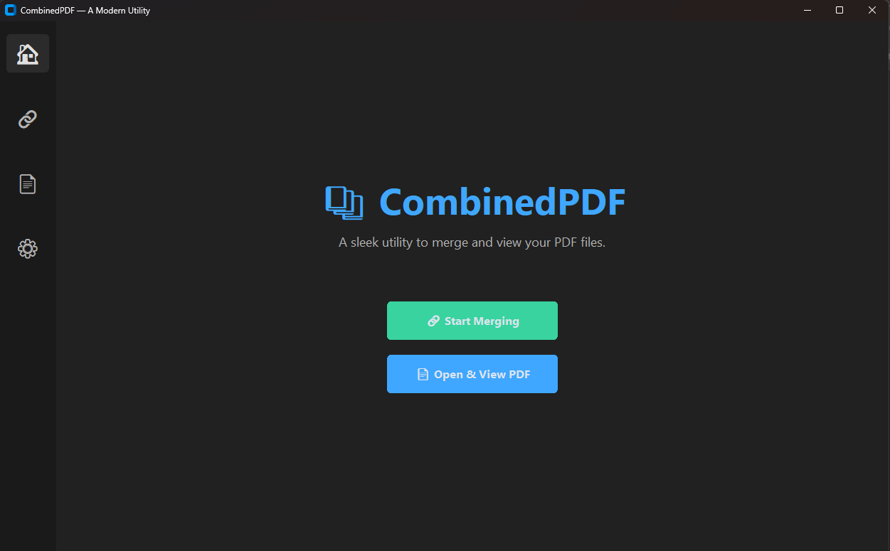
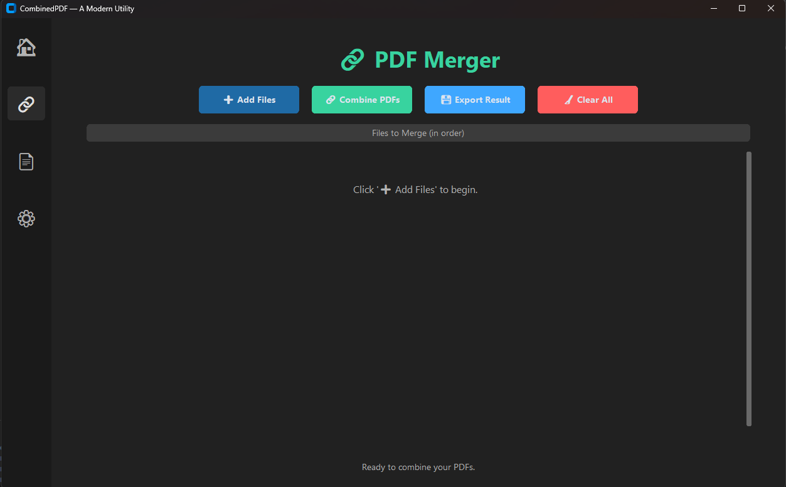
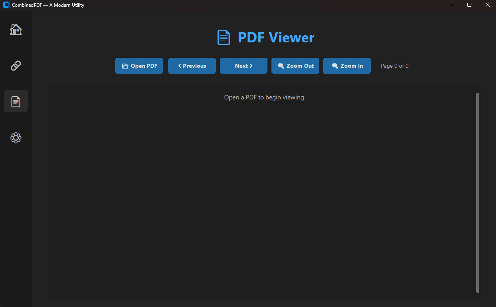

# CombinedPDF v1.0

A professional Python desktop app to quickly preview and merge PDF files with a clean dark UI.


## 📸 Screenshots

### Main Interface


### Merge Dialog


### Preview


## ✨ Features

- 🧭 **Simple Workflow**: Two actions on the left – Open PDF and Merge PDF
- 🔍 **Live Preview**: Renders pages on the right with smooth scrolling
- 🔎 **Zoom Controls**: Slider and +/- buttons, plus Ctrl + mouse wheel
- 🖱️ **Natural Scrolling**: Use the mouse wheel to move through pages
- 📎 **Merge Order**: Result = PDF 2 (base) + PDF 1 (appended to end)
- 💾 **Save As**: Export the current or merged PDF anywhere
- 🧼 **Clear**: Reset selection and preview instantly
- 🎨 **Dark, Modern UI**: Clean panels and a generated app icon

## Installation

1. Install Python 3.8 or higher
2. (Recommended) Create and activate a virtual environment
3. Install dependencies:

```bash
pip install -r requirements.txt
```

## Usage

1. Run the application:

```bash
python app.py
```

2. Workflow:
   - Click **Open PDF** to preview a single PDF
   - Click **Merge PDF** to open a dialog, choose PDF 1 (to append) and PDF 2 (base), then press Merge
   - The merged document will preview on the right
   - Use **Save As** from the left panel or right‑click menu in the preview
   - Use the mouse wheel to scroll; use Ctrl + mouse wheel or the slider to zoom

3. Controls:
   - **Zoom In/Out**: `+` or `-` buttons, or Ctrl + mouse wheel
   - **Scroll**: Mouse wheel
   - **Save**: Left panel “Save As” or right‑click the preview

## 📁 Project Structure

```
CombinedPDF/
├── app.py                    # Main application
├── requirements.txt          # Python dependencies
├── README.md                 # This file
├── assets/
│   ├── combinedpdf.ico       # App icon (autogenerated if missing)
│   └── combinedpdf.png       # Icon PNG (autogenerated if missing)
└── images/                   # Place your screenshots here
```

## Requirements

- Python 3.8+
- PyMuPDF (imported as `fitz`)
- pypdf
- Pillow

Install via:

```bash
pip install -r requirements.txt
```

## 🚀 Quick Start

```bash
# Clone the repository
git clone https://github.com/Dyamonic/CombinedPDF.git
cd CombinedPDF

# Install dependencies
pip install -r requirements.txt

# Run the application
python app.py
```

## 🎯 Use Cases

- Combine reports, statements, or forms in a set order
- Preview multi‑page PDFs with responsive zoom and scrolling
- Rapidly export merged documents with minimal clicks

## 📝 Notes

- Preview uses raster rendering; very large PDFs can take time/memory
- When merging, the resulting order is strictly: PDF 2 pages followed by PDF 1 pages
- The app auto‑generates a simple icon into `assets/` on first run

## 🤝 Contributing

1. Fork the repository
2. Create a feature branch (`git checkout -b feature/cool-improvement`)
3. Commit your changes (`git commit -m "Add cool improvement"`)
4. Push to your branch (`git push origin feature/cool-improvement`)
5. Open a Pull Request

## 📄 License

This project is licensed under the MIT License — see the [LICENSE](LICENSE) file for details.

## ⭐ Support

If you find this project helpful, please give it a star! ⭐

